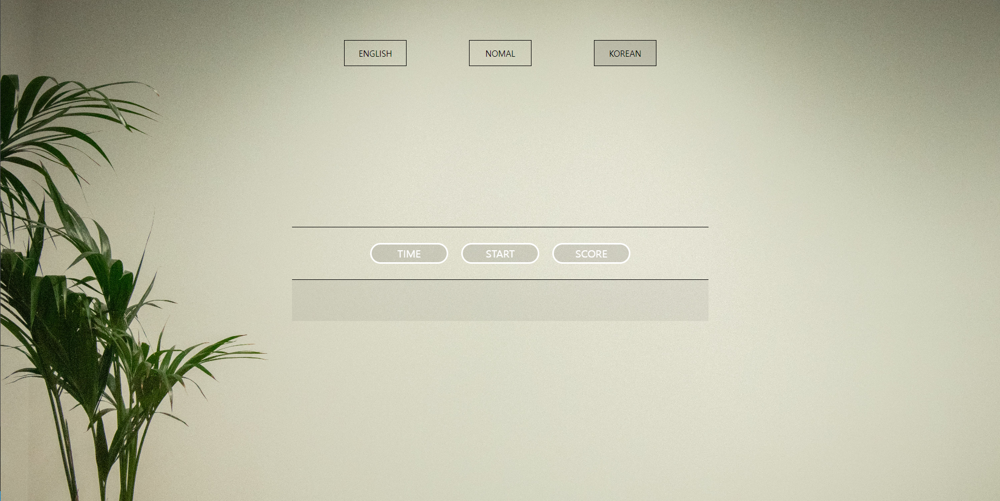

# Typing game

**HTML, CSS, JavaScript로 제작되었습니다.**  
**반응형 웹페이지로 모바일에서도 부드러운 화면을 제공합니다.**

## 개요

모두가 거리낌없이 타자게임을 할 수 있는 사이트를 제작해보고자 기획하게 되었습니다.
[Demo](https://jade-hummingbird-16ab9c.netlify.app/)

## 기능 소개

### 1. EASY, NOMAL, HARD라는 다양한 Level을 제공합니다.

     1-1 웹 페이지를 새로 로드하더라도 Level은 변경되지 않습니다.

### 2. KOREAN, ENGLISH 두 개의 언어를 제공합니다.

     2-1 웹 페이지를 새로 로드하더라도 언어는 변경되지 않습니다.
     2-2 언어에 따라 타이핑 해야하는 언어가 변경됩니다.

### 3. Timer-line을 제공합니다.

     3-1 Timer-line은 화면의 크기에 상관없이 남은 시간을 선으로 표시합니다.

### 4. Time : 남은 시간을 숫자로 표시합니다.

     4-1 시간이 종료되면 TIMEOUT 되며 재시작 할 수 있습니다.

### 5. Start button : Game을 실행할 수 있습니다.

      5-2 Game 실행시 RESET BUTTON 으로 변경됩니다.

### 6. Score : 한 개의 문장을 완료하면 1점을 획득하고 재시작시 Reset 됩니다.

    6-1 Game을 종료한 이후에 이전의 점수를 확인할 수 있습니다.

### 7. 검사 : 타자의 속도보다 정확도의 중점을 둔 GAME입니다.

    7-1 한 단어라도 틀리면 다음 문장으로 넘어가지 못 하도록 설정해두었습니다.

## 주의사항

- 문장을 다 입력후에 넘길때는 모바일,PC 어디든 `Space-Bar` 또는 `Enter` 키를 통해 제출할 수 있습니다.
